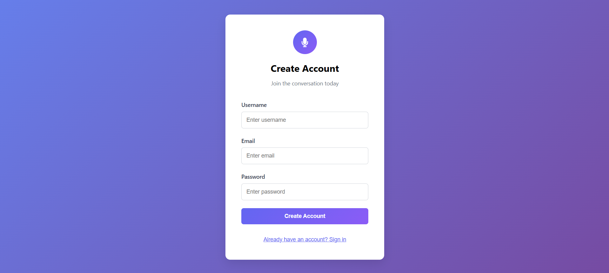
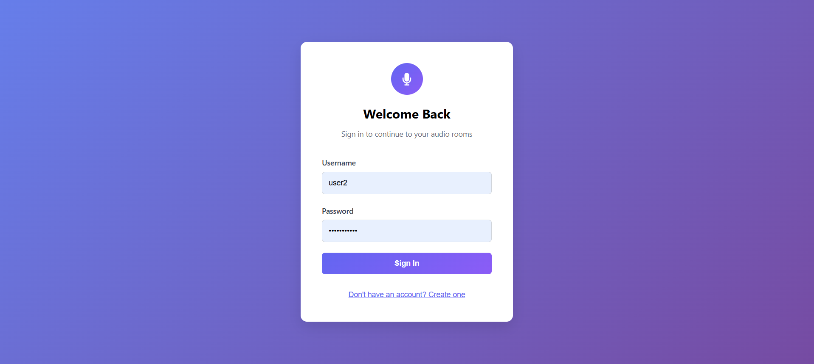
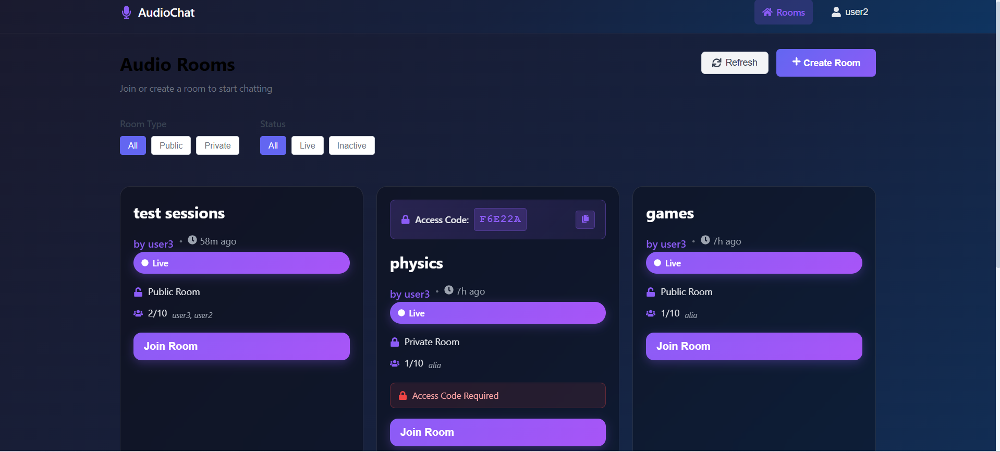
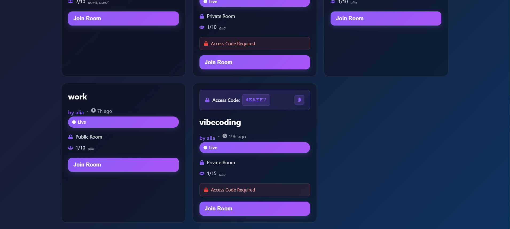
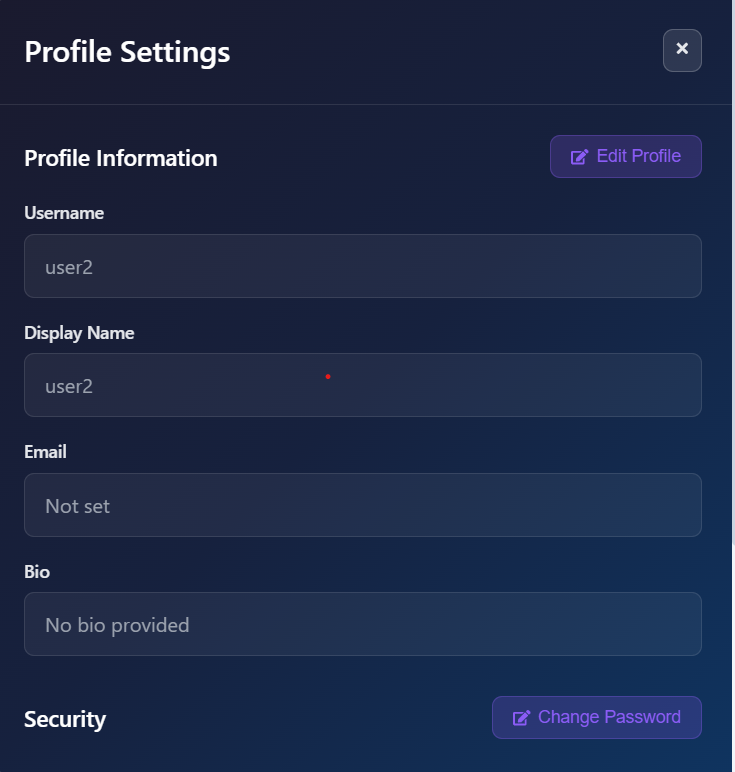
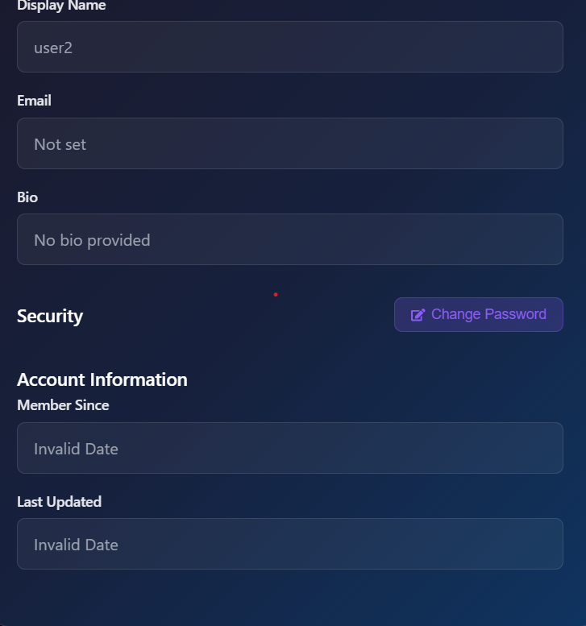
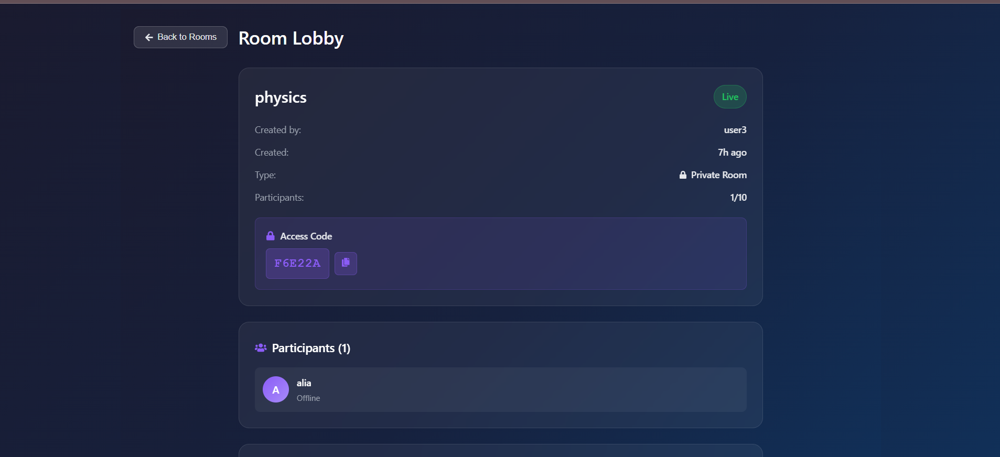
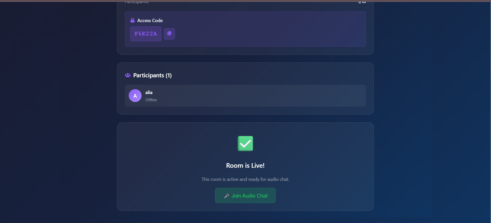
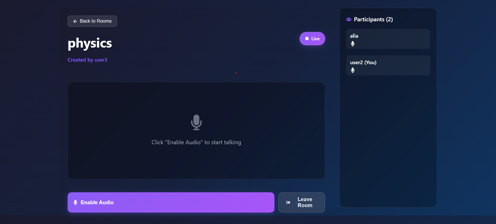
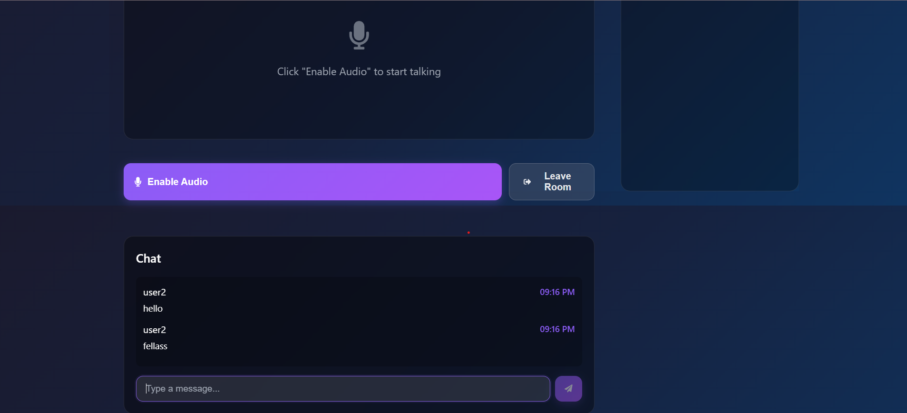

# Audio Chat Application

## Project Description
A **real-time audio chat application** built with the **MERN stack** (MongoDB, Express, React, Node.js). This app allows users to join virtual rooms and chat with each other using real-time audio communication. It also includes user authentication, room management, and a modern, responsive UI.

## Features
- Real-time audio chat functionality using WebSockets
- User authentication using **JWT** tokens
- Multi-room support for different chat rooms
- User-friendly and responsive UI built with **React**
- Secure and scalable backend using **Node.js**, **Express**, and **MongoDB**
- Socket.IO integration for real-time communication

## Screenshots

### Authentication Screens
#### Sign Up
  
User registration screen.

#### Sign In
  
User login screen.

### Rooms
  
An second part of the **rooms** page.  
  
Here is the rooms page.

### Profile Settings
  
second part of the **profile settings**.  
  
Profile settings page for users.

### Lobby Interface
  
The second part of the **lobby**.  
  
The initial view of the **lobby**.

### Chatroom Interface
  
The chatroom continues here.  
  
This is the main **chatroom** interface.
